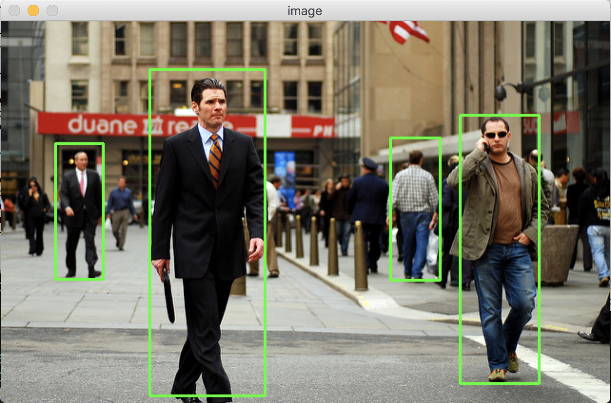

# ROI Selector

Simple tool to select regions of interest on an image.

## Getting Started

Clone this repo:

```
$ git clone https://github.com/salimmj/ROI_selector.git/
```

## Prerequisites

You need Python 3, OpenCV (cv2), Numpy, argparse, and Pickle


## How to Use

{imagepath} : path to image on which we select ROI
{picklepath} : path to pickle file to serialize the numpy array of ROI

```
$ python ROI_selector.py --image {imagepath} --roi {picklepath}
```

For example:

```
$ python ROI_selector.py --image example.jpg --roi example.p 
```
Click, drag, release to select the ROI. It is usually laggy and slow depending on the size and resolution of the image, so keep the mouse cursor on the second point when you release until the rectangle appears.



Click 'r' to reset.

When you have selected all the ROI and are done, click 'd'. 

```
$ python ROI_selector.py --image example.jpg --roi example.p  
[(565, 99), (482, 382)]
[(277, 51), (156, 395)]
[(461, 123), (409, 273)]
[(107, 129), (57, 272)]
Saved Regions of Interest as Pickle file in: example.p
```

### Pickle file format

Unloading the pickle file will give you one N by 4 matrix where N is the number of regions of interest selected in the picture. 

Every row [ a b c d ] is in fact a rectangular ROI defined by the points (a,b) and (c,d)
